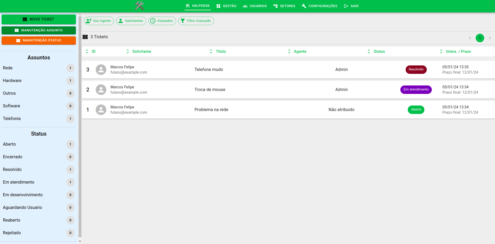

# HELPDESK




Este é uma aplicação web para gerenciamento de helpdesks (chamados) abertos
a equipe de TI. Toda equipe, por menor que seja precisa de um processo de Helpdesk
que permita a mesma a controlar as requisições a serem feitas, para assim tornar
o trabalho bem mais organizado e eficaz.

Esta aplicação tem os seguintes recursos.

- Customização de fluxo de status
- Cadastro de Assuntos
- Padronização e modificação de cores dos status e assuntos
- Envio de email na abertura dos chamados
- Cadastro de usuários
- Cadastro de agentes (usuários que responderam sobre os chamados)
- Gráficos estatisticos dos chamados com relação de atendimentos, agentes e solicitantes.
- Auto-encerramento dos tickets Aguardando Usuário há X dias (padrão 10)

## COMO FOI DESENVOLVIDO ? 🤔

Esta aplicação foi desenvolvida usando tecnologias como:

- Python-Flask (Backend)
- ReactJS (Frontend)

No backend além do Framework Flask temos as seguintes libs de apoio.

- flask-login
- flask-mail
- flask-sqlalchemy
- flask-smorest
- flask-apscheduler
- Dentre outras

Já no frontend além da base ser em React temos as seguintes libs de apoio.

- MUI
- react-hook-form
- @uiw/react-color
- emoji-picker-react
- slate (slate-history, slate-react)
- react-use
- Dentre outras

---

### COMO CONFIGURAR ? 🔧

Este aplicativo foi desenvolvido para ser o mais customizavel possível, então você deve disponibilizar um arquivo _.env_ para que ele possa funcionar sem problemas. Este arquivo deve ser criado com as informações que são contidas no arquivo de exemplo chamado _.env_example_.

Depois de criado o arquivo .env pode-se seguir a próxima sessão de inicialização do sistema.

---

### COMO INICIALIZAR ? 🚀

Você pode inicializar o projeto na sua máquina local, em um virtualenv ou mesmo com Docker. Estarei cobrindo neste tutorial a forma de utilização com o Docker e usando um virtualenv.

---

### CONFIGURAÇÕES DE VARIAVEIS

Faça uma cópia do arquivo .env_example.

```
cat .env_example > .env
```

As variáveis contidas agora no arquivo .env com suas explicações são as seguintes:

- URI_DATABASE : Caminho para conexão ao banco de dados. Caso não tenha um SGBD você pode usar o sqlite (sqlte:///helpdesk.db)

- SECRET_KEY : Aplicações Flask, precisam de um secret_key para assinar cookies. Você pode gerar um valor randomico com secrets.token_urlsafe(128) (da lib secrets) e colar seu conteúdo aqui.

- EMAIL_USER : O endereço de email do usuário que vai enviar os emails

- EMAIL_PASSWORD: A senha do usuário que vai enviar os emails

- SMTP: O endereço smtp do servidor de emails

- SMTP_PORT: A porta do servidor smtp, pode colocar um numero com aspas

- EMAIL_FROM: O email que será descrito como quem enviou

- USE_TLS: Ativa ('1') ou desativa ('0') o uso de TLS

- USE_SSL: Ativa ('1') ou desativa ('0') o uso de SSL

- URL_PUBLIC: A URL onde sua aplicação pode ser alcançada externamente. As imagens que serão exibidas no corpo do email precisam deste endereço publico de acesso.
- SCHEDULER_API_ENABLED : Determina que o agendador de tarefas vai estar executando ('1' ativo) ou não ('0' inativo)

- APP_DEBUG : Define se o debug vai estar ativo ('1') ou não ('0'). Se você não esta em um ambiente de desenvolvimento recomendo deixar como '0'.

---

### CRIANDO A APLICAÇÃO COM DOCKER 🐳

Você precisa ter o Docker instalado na sua maquina local, confirmada esta parte existe um arquivo Dockerfile que permitirá que você crie a imagem para os containers. Você pode executar o comando no terminal.

```
docker build . -t helpdesk:latest
```

Depois que a imagem for criada, você pode inicializa-la com o comando:

```
docker run -d --name helpdesk -p 5000:5000 helpdesk:latest
```

Caso você tenha o taskipy (Será coberto na sessão comandos para o virtualenv) você consegue criar a imagem somente com o comando

```
task build
```

Para ver se a aplicação esta funcionando você pode se comunicar nela clicando neste link [LINK AQUI](http://localhost:5000)

---

### Criando a aplicação usando Virtualenv 🐍

Caso você não tenha o Docker disponível e queira subir a aplicação para produção ou para fins de desenvolvimento, é indicado fazer uso de um ambiente virtual. Os ambientes virtuais permitem isolar o seu ambiente local do ambiente em que o sistema precisa executar, este tipo de isolamento é muito comum no meio de desenvolvimento de aplicações Python e permite ao desenvolvedor ter diferentes versões do Python, libs e packages instalados na maquina.

Para criar um ambiente virtual execute o seguinte comando (lembrando que o Python precisa ser o da versão `3.10 ou superior`) dentro do diretorio raiz do projeto.

```
python3 -m venv .venv
```

Depois só ativar o ambiente virtual com

```
source .venv/bin/activate
```

Faça a instalação das libs necessárias do projeto com o seguinte comando

```
pip install -r requirements.txt
```

Dependências instaladas o próximo passo é criar/configurar o arquivo .env. Este passo já foi descrito mais acima e deve ser feito antes mesmo de criar uma imagem de container ou iniciar o ambiente virtual.

Depois de configurada as variáveis o próximo passo é realizar a configuração inicial do banco. Isso pode ser feito com um único comando.

```
task initdb
```

Isso vai criar as tabelas iniciais no banco de dados (eu acredito que você configurou a variavel URI_DATABASE) e preencher alguns registros básicos para o sistema funcionar como a tabela de status e assuntos (que são customizaveis dentro da aplicação).

Depois de concluído este passo agora só basta você executar a aplicação com o comando abaixo.

```
task deploy
```

E pronto, a aplicação do Helpdesk esta ativa e funcionando.

---

### CREDENCIAIS INICIAIS 🔑

Quando você executa pela primeira vez o sistema um usuário administrador é criado, ele tem um perfil de agente e pode configurar todas as outras áreas do site. Seus dados de credenciais são:

```
usuario: admin@plimo263help.com
senha: admin
```

**⚠️ Lembre-se de criar outro usuário para você e inativar este imediatamente**

---

#### OUTROS COMANDOS UTEIS DO CLI

Abaixo uma lista de comandos úteis do CLI Taskipy

- pre_initdb Remove o banco de dados sqlite

- initdb Preenche os dados iniciais do banco

- pre_install python3 -m venv .venv

- install Realiza a instalação das dependências em ambiente virtual

- build Constrói uma imagem Docker pronta para uso

- debug Executa em modo debug (reload ativado)

- deploy Executa em modo produção

---

### Backend e Frontend Separados

Esta aplicação tem separação de backend/frontend sendo que o backend atua mais como uma API Rest e o frontend é desenvolvido usando React. O grande ganho desta separação esta na capacidade de se poder construir um frontend desacoplado no futuro, Ou seja, nada impede de ser construído um frontend para Desktop e/ou Mobile fazendo chamadas a API, isso torna esta aplicação boa e multiplataforma.

### Agradecimentos 🥰

Área para agradecimentos por contribuições para tornar este Helpdesk cada vez mais melhor.

@plimo263
